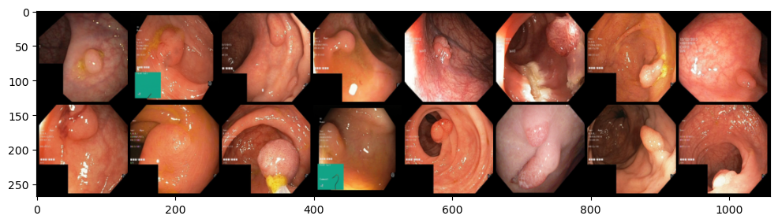
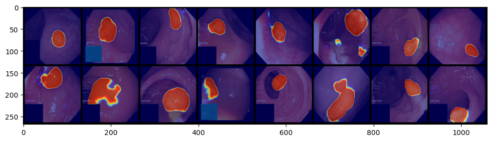
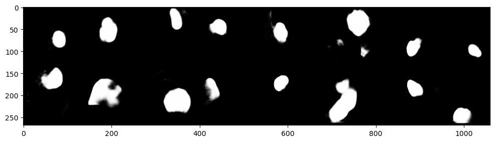
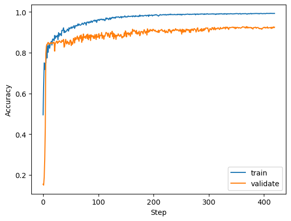
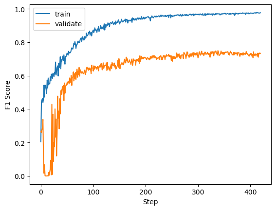

# POLYP SEGMENTATION

## The task
Given an endoscopic image, we have to predict a binary mask where 1's pixels are the polyps' regions.

## Assumptions
Let the mask be a random variable $M$ and the input image is also a random variable $X$. To perform the segmentation task, we estimate the conditional probablity $P(M=m|X=x)$. Due to the assumption that the mask is binary, $P(M=m|X=x)$ is a Bernoulli distribution, which means that $m|x \sim \text{Ber}(\lambda(x))$ where $\lambda(x)$ is modeled using a neural network $G_\theta(x)$ ($\theta$ is a set of the network's parameters). In conclusion, we have to estimate $\text{Ber}(m;G_\theta(x))$. Another assumption is that the elements in an arbitrary $m^{< i>}$ are independent for the sake of calculating the later join probabilities.

## Methodology
Given a set of training data including endoscopic images $(x^{< 1>}, x^{< 2>}, ..., x^{< N>})$ and target masks $(m^{< 1>}, m^{< 2>}, ..., m^{< N>})$ (any $x^{< i>}$ or $m^{< i>}$ is vector-valued), our goal is maximizing the conditional log-likelihood of this training dataset:  

```math
\begin{align*}
\theta^* &= \text{argmax}_\theta {\sum_{i=1}^N \log P(m^{< i>}|x^{< i>})} \\
         &= \text{argmax}_\theta \sum_{i=1}^N \log \text{Ber}(m^{< i>};G_\theta(x^{< i>}))
\end{align*}
```
We have assumed that the elements in an arbitrary $m^{< i>}$ are independent. Therefore:

```math
\begin{align*}
\theta^* &= \text{argmax}_\theta\ \sum_{i=1}^N \sum_{k=1}^K \log \text{Ber}(m^{< i>}_k;G_\theta(x^{< i>})_k) \\

         &= \text{argmax}_\theta\ \sum_{i=1}^N \sum_{k=1}^K \log G_\theta(x^{< i>})_k^{m^{< i>}_k} (1 - G_\theta(x^{< i>})_k)^{1 - m^{< i>}_k} \\

         &= \text{argmax}_\theta\ \sum_{i=1}^N \sum_{k=1}^K {m^{< i>}_k}\log G_\theta(x^{< i>})_k + ({1 - m^{< i>}_k})\log(1 - G_\theta(x^{< i>})_k)
\end{align*}
```

It turns out that we have to optimize a binary cross-entropy loss function.  
In this project, the neural network $G_\theta(x)$ is modeled as a Spatial-attention U-Net.

## Testing results
The network achieved an accuracy of 0.92 and a f1 score of 0.75 on the KvasirSEG test dataset.
Here are some concrete testing samples:
* Input endoscopic images

* Heat maps

* Predicted probability masks

* Ground truth


The learning curves:
<p align="center">
  
   
</p>

## Application
### Demo
Give it a try [here](https://polyp-segmentation.streamlit.app/)


### How to run locally
* Clone this repository
```
git clone https://github.com/havisdino/polyp-segmentation.git
cd polyp-segmentation
```
* Install dependencies
```
pip install -r requirements.txt
```
* Run the app
```
streamlit run app.py
```
